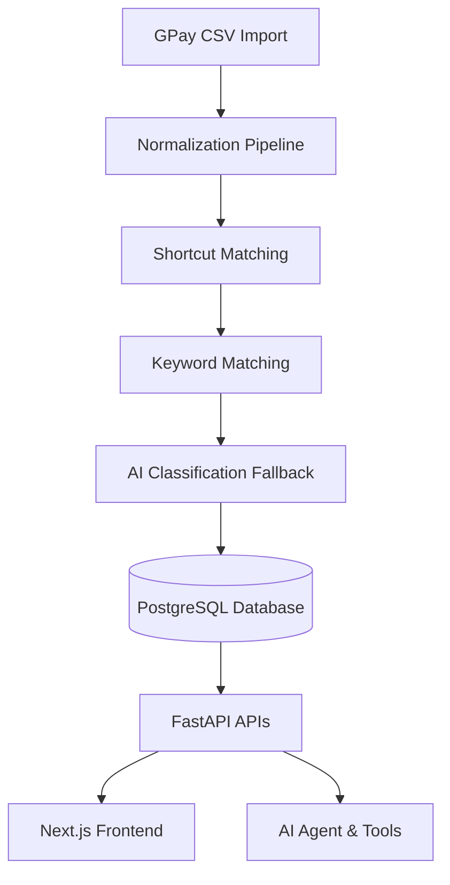

# ☕ Spending Tea

### "Your money has receipts. Your AI should too."

Spending Tea is an AI-native personal finance assistant designed to handle messy transaction data (like Google Pay exports), interpret personal shorthand notes, and deliver verified summaries without hallucinating calculations.

## The Problem
When asking general-purpose LLMs about personal finance data, they often:
1. **Hallucinate arithmetic**: confidently stating wrong totals.
2. **Fail on messy data**: misinterpreting duplicates, self-transfers, or refunds.
3. **Over-assume**: guessing categories for vague notes instead of acknowledging uncertainty.

## The Solution
Spending Tea solves this with a structured, deterministic classification and aggregation pipeline:



1. **Deterministic Ingestion**: Cascading classifier checks user-defined shortcuts and keyword rules before resorting to AI context maps.
2. **Trust Rating System**: Calculates an overall score (Completeness, Freshness, Category Confidence, Duplicates Risk) to measure source reliability.
3. **AI Abstention**: Refuses to output numbers when uncategorized items exceed thresholds, prompting reviews first.
4. **Calculations in SQL/Python**: Uses typed tools (`get_category_spending`, etc.) to run queries, ensuring 100% mathematical correctness.

## Stack
- **Frontend**: Next.js 15+, Tailwind CSS, TypeScript, Recharts
- **Backend**: Python FastAPI, SQLAlchemy, PostgreSQL
- **AI Agent**: Structured outputs, tool calling, trust validators

## Getting Started

1. Set up your environment variables:
   ```bash
   cp .env.example .env
   ```
2. Launch the services:
   ```bash
   docker-compose up --build
   ```
3. Open `http://localhost:3000` to start tracking.
