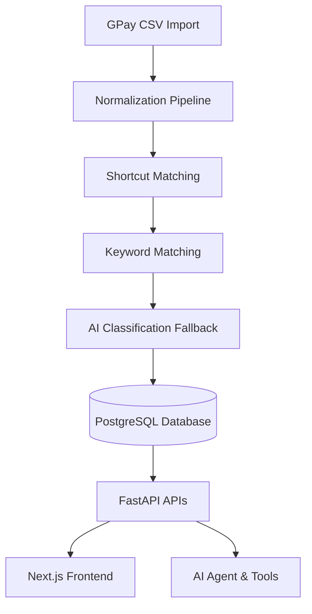

# Architecture - Spending Tea

Spending Tea is built around a secure and deterministic data processing pipeline, combining structured database aggregations with LLM tool calling.

## Ingestion Pipeline

1. **Casings Normalization**: Unifies merchant names (e.g. `SWIGGY` -> `Swiggy`).
2. **Shortcuts Resolver**: Inspects user key-value mappings before calling AI.
3. **Refunds/Duplicates Handler**: Flags likely duplicates without removing them, adjusting overall trust scores.

## Agent System
- **Deterministic Math**: The Agent is forbidden from executing direct calculations; it leverages SQL tools instead to compute sums.
- **Safety Abstention**: If data completeness drops below 80%, the Agent qualifies the answer or refuses to respond, preventing hallucinations.
